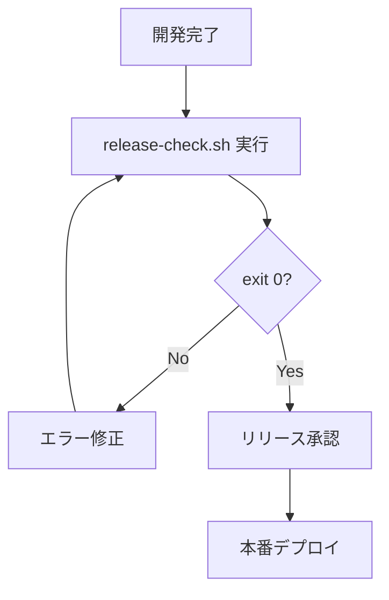

# Validation Scripts

## 概要

プロジェクトのコード品質とリリース可否を検証する**3つのスクリプト**。

---

## 1. `release-check.sh` ⭐️ 最重要

**リリース前の包括的検証（必須実行）**

```bash
./dev-kit/scripts/validations/release-check.sh
```

### 目的
あらゆる致命的バグを事前検出してリリース可否を判定

### 検証カテゴリ（7カテゴリ・25+項目）

| カテゴリ | 項目数 | 検出内容 |
|---------|--------|----------|
| ルーティング整合性 | 4 | ルート名の不整合、重複、一時ルート残存、無名ルート |
| Inertia.js整合性 | 3 | パス形式誤り、ファイル不存在、Props型定義なし |
| フロントエンド品質 | 4 | TSコンパイルエラー、未使用import、console.log残存、ハードコードURL |
| バックエンド品質 | 4 | PHPUnitテスト失敗、PHP構文エラー、デバッグコード残存、日本語メッセージ形式 |
| データベース整合性 | 2 | マイグレーション実行不可、未実行マイグレーション |
| セキュリティ | 3 | .env設定不足、APP_DEBUG=true、機密情報ハードコード |
| ページレンダリング | 1 | 重要ページが真っ白 |

### 終了コード
- `0`: 全検証合格 → **リリース可能** ✅
- `1`: 致命的エラーあり → **リリース不可** ❌

### ログファイル
`logs/comprehensive-release-check-YYYYMMDD-HHMMSS.log`

### 実行タイミング
- ✅ リリース前（**必須**）
- ✅ プルリクエストマージ前
- ✅ 重要な変更後

### 今回の不具合対応

このスクリプトは、以下の致命的バグを受けて作成されました:

1. **登録確認画面に遷移できない**
   - `routes/web.php`の一時ルートが正式ルートを上書き
   - → ルート重複検出、一時ルート残存チェックで検出

2. **ダッシュボードが真っ白**
   - Inertia.jsのパスが`templates/auth/SignupPage`と誤っていた
   - → Inertiaパス形式チェック、ページレンダリング検証で検出

**このスクリプトが `exit 0` で終了しない限り、リリース禁止**

---

## 2. `frontend.sh`

**フロントエンド開発中の品質チェック**

```bash
./dev-kit/scripts/validations/frontend.sh
```

### 検証内容
- Phase 1: 構文チェック（ESLint）
- Phase 2: TypeScript型チェック
- Phase 3: import文の整合性
- Phase 4: useDynamicValidation使用チェック
- Phase 5: 未使用変数検出
- Phase 6: テストコード品質チェック
- Phase 7: UIテンプレート厳密検証
- Phase 8: バリデーションロジック検証

### 実行タイミング
- フロントエンド実装後
- React/TypeScriptコード変更後

---

## 3. `backend.sh`

**バックエンド開発中の品質チェック**

```bash
./dev-kit/scripts/validations/backend.sh
```

### 検証内容
- Phase 1: PHP構文チェック
- Phase 2: Clean Architecture準拠チェック
- Phase 3: バリデーションルールチェック
- Phase 4: リポジトリパターンチェック
- Phase 5: 日本語バリデーションメッセージチェック
- Phase 6: データベースマイグレーション整合性

### 実行タイミング
- バックエンド実装後
- PHP/Laravelコード変更後

---

## リリースワークフロー



### ステップ詳細

```bash
# Step 1: 包括的リリース検証（必須）
./dev-kit/scripts/validations/release-check.sh

# exit 0 で終了した場合のみ、リリース可能
# exit 1 で終了した場合は、ログを確認してエラーを修正
```

---

## CI/CD統合例

### GitHub Actions

```yaml
name: Release Validation

on:
  pull_request:
    branches: [main]

jobs:
  release-check:
    runs-on: ubuntu-latest
    steps:
      - uses: actions/checkout@v3
      - name: Run Release Check
        run: ./dev-kit/scripts/validations/release-check.sh
```

---

## トラブルシューティング

### Q1: `release-check.sh`が失敗する

**A**: ログファイルを確認してください。

```bash
# 最新のログを確認
cat logs/comprehensive-release-check-*.log | tail -100
```

失敗した項目を修正して再実行してください。

### Q2: 警告（⚠️）は無視しても良いか

**A**: 致命的エラー（❌）は修正必須ですが、警告（⚠️）は推奨レベルです。
ただし、以下は本番環境では必ず対応してください:
- `APP_DEBUG=true` → `false`に変更
- 機密情報ハードコード → 環境変数化

### Q3: 開発中に毎回`release-check.sh`を実行すべきか

**A**: No. 開発中は`frontend.sh`/`backend.sh`を使用してください。
`release-check.sh`はリリース前のみ実行してください。

---

## ディレクトリ構成

```
dev-kit/scripts/validations/
├── README.md          # このファイル
├── release-check.sh   # リリース前包括検証（最重要）
├── frontend.sh        # フロントエンド品質チェック
└── backend.sh         # バックエンド品質チェック
```

**3つのスクリプトのみ。シンプルで明確。**

---

## まとめ

### リリース必須ルール

**`release-check.sh`が`exit 0`で終了しない限り、リリースしてはいけません。**

例外はありません。

### スクリプトの使い分け

| スクリプト | タイミング | 必須度 |
|-----------|-----------|--------|
| `release-check.sh` | リリース前 | ⭐️⭐️⭐️ 必須 |
| `frontend.sh` | フロントエンド実装後 | ⭐️⭐️ 推奨 |
| `backend.sh` | バックエンド実装後 | ⭐️⭐️ 推奨 |

### 検証の包括性

**`release-check.sh`は25+項目を自動チェック**:
- ルーティング問題
- UI表示問題
- コード品質問題
- データベース問題
- セキュリティ問題

あらゆる致命的バグを事前に検出します。

---

## 関連ドキュメント

詳細な技術情報は以下を参照:
- `dev-kit/docs/COMPREHENSIVE_RELEASE_VALIDATION.md` - 包括的検証の詳細ガイド
